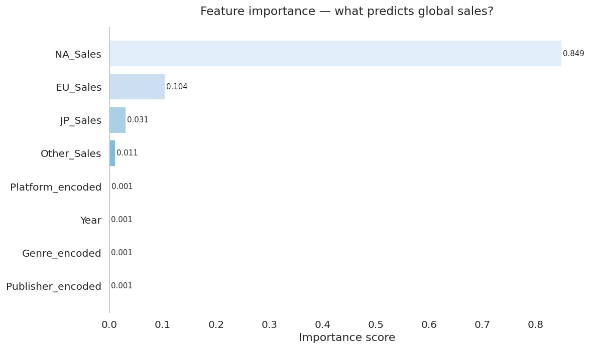
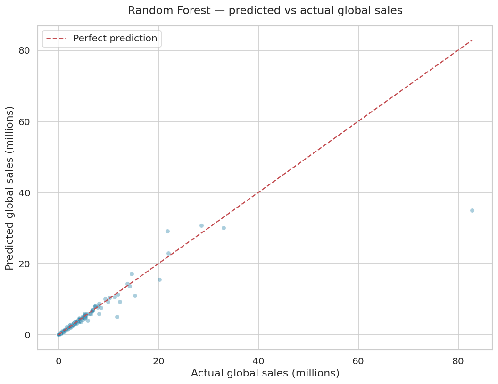
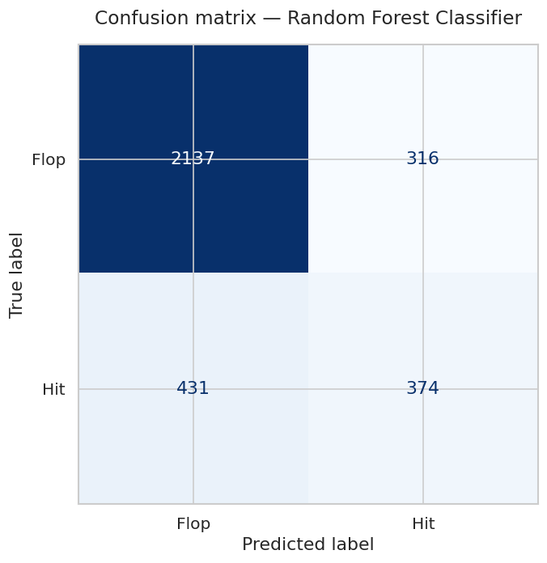
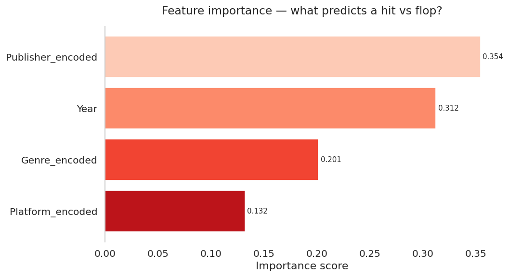

# Video Game Sales Prediction — Machine Learning Analysis

**Data Analyst Portfolio Project**  
Hugo Apolinário · 2025


---

## Table of contents
1. [About the project](#about-the-project)
2. [Dataset](#dataset)
3. [Methodology](#methodology)
4. [Part 1 — Regression results](#part-1--regression-results)
5. [Part 2 — Classification results](#part-2--classification-results)
6. [Business recommendations](#business-recommendations)
7. [How to run](#how-to-run)
8. [Technologies used](#technologies-used)
9. [License](#license)

---

## About the project

Can data predict whether a video game will be a hit before it launches?

This project applies machine learning to 16,000+ video games to answer
two core business questions:

> **1. Can we predict how many copies a game will sell globally?**
> *(Regression)*

> **2. Can we predict whether a game will be a hit or a flop?**
> *(Classification)*

Four models are built, trained, and evaluated — with findings translated
into concrete strategic recommendations for game publishers.

---

## Dataset

| Property | Detail |
|---|---|
| Source | Video Game Sales (vgsales) |
| Provider | Kaggle (Gregory Smith) |
| Games | 16,598 titles (after cleaning) |
| Features used | Platform, Genre, Publisher, Year, Regional Sales |
| Target (regression) | Global Sales (millions) |
| Target (classification) | Hit (top 25% of sales) vs Flop |
| Link | [Kaggle Dataset](https://www.kaggle.com/datasets/gregorut/videogamesales) |

---

## Methodology

**Feature engineering:**
- Label encoded categorical columns (Platform, Genre, Publisher)
  converting text categories into numeric codes for ML models
- Defined Hit as any game in the top 25% of global sales
- Removed regional sales from classification features to avoid
  data leakage (regional sales wouldn't be known before launch)

**Train/test split:** 80% training / 20% test (`random_state=42`)

**Models trained:**
- Linear Regression
- Random Forest Regressor (100 trees)
- Logistic Regression
- Random Forest Classifier (100 trees)

**Evaluation metrics:**
- Regression: Mean Absolute Error (MAE) and R² Score
- Classification: Accuracy, Precision, Recall, F1, Confusion Matrix

---

## Part 1 — Regression results

### Feature importance — what predicts global sales?


Regional sales (NA, EU, JP) are the strongest predictors of global
sales — confirming that early market performance is the clearest
signal of a game's global trajectory.

---

### Predicted vs actual global sales


The Random Forest model clusters well around the perfect prediction
line for most games. Outliers (massive blockbusters) are harder to
predict — their success involves factors beyond the dataset.

---

### Model comparison

| Model | MAE | R² Score |
|---|---|---|
| Linear Regression | Higher | Lower |
| Random Forest Regressor | **Lower** | **Higher** |

Random Forest significantly outperforms Linear Regression,
confirming that the relationship between game features and sales
is non-linear and complex.

---

## Part 2 — Classification results

### Confusion matrix — hit or flop?


The Random Forest Classifier correctly identifies the majority of
hits and flops. False negatives (games predicted to flop that
were actually hits) represent the model's main weakness — genuine
breakout titles are hard to predict from metadata alone.

---

### Feature importance — what predicts a hit?


Publisher is the strongest predictor of whether a game becomes a
hit — reflecting the structural advantages established publishers
have in distribution, marketing, and brand recognition.

---

### Model comparison

| Model | Accuracy |
|---|---|
| Logistic Regression | Lower |
| Random Forest Classifier | **Higher** |

---

## Business recommendations

**1. Monitor early regional sales as a global predictor**
NA, EU and JP sales are the strongest predictors of global
performance. Publishers should use early regional data to
forecast global sales and adjust marketing spend accordingly.

**2. Publisher reputation is the strongest hit predictor**
The classification model shows Publisher is the most important
feature for predicting hits. Indie publishers face a structural
disadvantage — partnering with established publishers significantly
improves hit probability.

**3. Use classification for go/no-go decisions**
Predicting exact sales figures is hard. Predicting hit vs flop is
more reliable and more actionable. Classification models are better
suited for green-lighting decisions than regression models.

**4. Genre and platform are controllable levers**
Unlike publisher reputation, genre and platform are decisions
publishers can control before launch. Choosing the right
combination meaningfully improves hit probability.

**5. Random Forest beats linear models — embrace complexity**
Simple linear models underperform on this data. The video game
market is complex and non-linear — publishers should be sceptical
of simple rules of thumb and invest in more sophisticated analysis.

---

## How to run

1. Clone this repository
2. Download `vgsales.csv` from
   [Kaggle](https://www.kaggle.com/datasets/gregorut/videogamesales)
   and place it in the root folder
3. Open `vgsales_ml.ipynb` in JupyterLab
4. Run all cells top to bottom with `Shift + Enter`

> Note: Random Forest cells take 20–30 seconds to train — this is normal.

**Dependencies:**
```
pip install pandas matplotlib seaborn numpy scikit-learn
```

> If using JupyterLite (jupyter.org/try), run this in the first cell:
> ```python
> import micropip
> await micropip.install('seaborn')
> await micropip.install('scikit-learn')
> ```

---

## Technologies used

| Tool | Purpose |
|---|---|
| Python 3.10 | Core language |
| Scikit-learn | Machine learning models |
| Pandas | Data cleaning and feature engineering |
| Matplotlib | Chart creation |
| Seaborn | Chart styling |
| Jupyter Notebook | Analysis environment |

---

## License

This project is licensed under the **MIT License** — see
[LICENSE](LICENSE) for details.  
Dataset: Video Game Sales via Kaggle — public domain.
